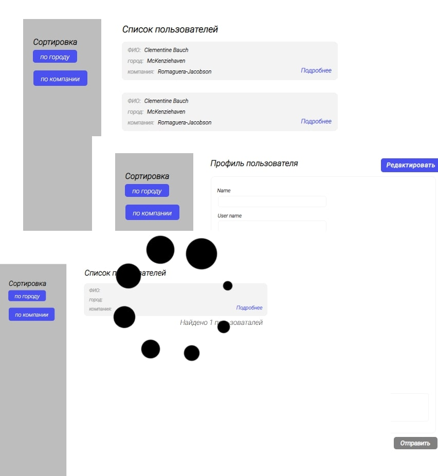

# Users List

## Your users should be able to:

- Compose with adaptive
- Notifications about the correctness of filling lines
- Make a filter
- Editing Users
- Edit button (unlock forms)
- Loader

## Usage

`npm i`

`npm start` `npm run server`

### Thanks to [Megahoma](https://github.com/megahoma) for tsconfig and eslint

### Coded by [EalsyCoD](https://github.com/EalsyCoD)